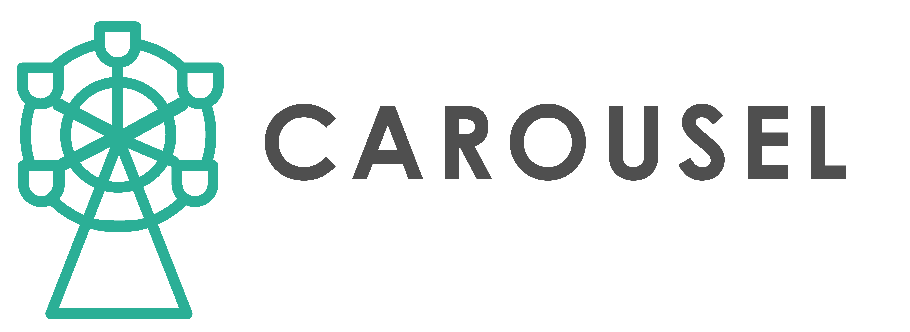

     

# CAROUSEL
The advanCed frAmewoRk fOr high-throUghput microStructurE simuLation is a precious tool for rapid alloy design. It is specially designed for performing high-throughput screenings of different chemical compositions and processing parameters. The precipitation behavior can be predicted for each chemical composition and processing parameter combination.  The developed approach is based on the CALPHAD method (Calculation of Phase Diagrams). The solidification process is modeled using the Scheil-Gulliver approach, which provides information about the primary precipitates. This information is further used to calculate the precipitation kinetics in solid-state. Using CAROUSEL, it is possible to optimize the manufacturing parameters (e.g. temperature, duration, cooling, and heating rates), test different alloy compositions, and track the history of a single precipitation phase. With the help of various analysis and visualization tools, underlying process-structure-property correlations can be detected, and promising combinations of chemical composition and process parameters can be identified according to user-defined criteria (e.g. strength of the material). 

# Important features

## Software structure
The CAROUSEL software structure consists of different packages. The two main ones are the graphical user interface (GUI) and the core implementation. The GUI is sufficient for using the framework. The user needs to look into the core implementation to extend the software.

## Graphical User Interface (GUI)
The CAROUSEL GUI is designed to interact with the framework without any programming knowledge easily. The GUI is built using C and WPF.Net on Visual Studio.

## Core Implementation
The core implementation includes logic for communication with external packages (e.g. external CALPHAD software, scripting language), data management, and data modeling. It is only necessary for advanced users who want to extend the software.

## Operating Systems
The CAROUSEL GUI is currently available only for Windows. In the future, it is planned to expand the availability of the software for other operating systems. The core implementation can be used on any operating system. 

## CALPHAD Software
The framework uses the external CALPHAD software MatCalc. It is important to note that CAROUSEL does not provide any license for the MatCalc software. A valid MatCalc license is required on the user side to use the framework. Alternatively, the user can use a free version of MatCalc, which is restricted to 3 chemical elements and free databases. MatCalc API is used for communication with CAROUSEL.

## High-Performance Computing
The thread manager is implemented into CAROUSEL to utilize all available resources to ensure efficient and rapid calculations. At the next step, it is planned to test the framework on a supercomputer.

## Scripting
Next to the GUI, CAROUSEL offers a scripting option using LUA. The scripting option gives access to various options and allows for creating complex simulation parameters and highly-automatized simulations of a large set of simulation parameters. Scripting allows a significantly higher degree of automation. 

## Data Management
The generated configuration data and simulation results are stored in a SQL database, providing fast access and storage of all data. This enables the users to retrieve information and enjoy several other benefits quickly. 

## Data Visualization
CAROUSEL offers different visualization options for fast data analysis. Different types of plots are implemented. Users can also interact with the data, create custom queries, and access other helpful visualization features.

     

# Installation of the GUI Version

- Download the [WPF desktop application]().
- Extract all files and place them in your desired directory.
- The application is now ready for use; you need to follow the instructions in the [documentation](https://github.com/SColibri/AMFramework/wiki) on how to get started.

# Documentation
A more detailed description of the CAROUSEL software can be found in the [documentation](https://codedocs.xyz/SColibri/AMFramework). This includes information about CAROUSEL and instructions on how to use and contribute to CAROUSEL.
